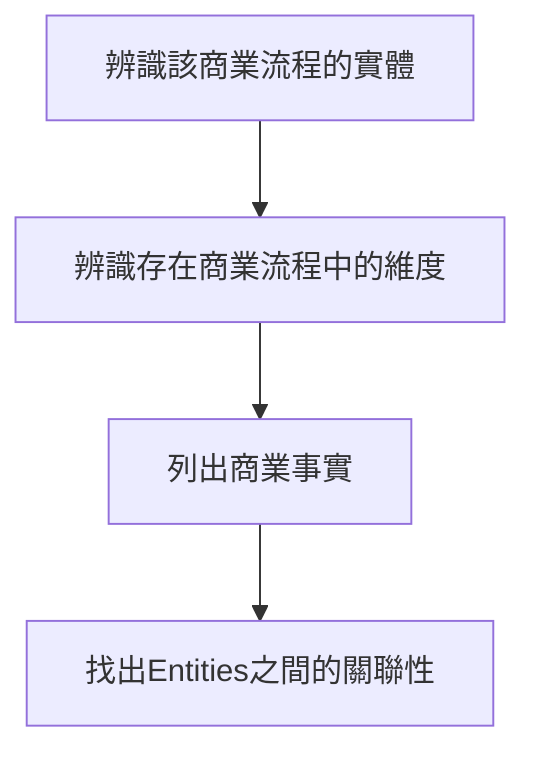

# Database Construction - Data Modeling
###  Why Data Modeling?
隨著硬體儲存空間的進步，過去需要耗費大量成本儲藏的資料在今日都能被視為驅動業務的寶藏。要如何將這些資料以適配於業務邏輯的方式存放到資料庫，便成為資料工程師的業務範疇之一。

建立Data Modeling對標於與資料庫設計的所學，但對應於實務上仍需要考慮業務單位會如何分析這些資料，因此會考慮更多的資料互動的關聯事實。

#### Model的建立可列為成以下四項關鍵流程：

### 1. 辨識該商業流程的實體(Identifying the entities in the business model)：
商業行為的出現有著多方的涉入，以最High Level的概念來說，買方、賣方、生財工具(如設備)、買方評價等等，依據不同的商業流程又會產生不同的樣態。
    
#### 以B2C電商平台作為例子
電商平台當中，會有以下實體：

a. 進駐商家資料(賣方)
b. 消費者資料(買方)
c. 購買評價
d. 商品資訊
e. 客戶服務
f. 結帳資料
g. 物流業者

### 2.辨識存在商業流程中的維度(Identifying the dimensions)：
商業行為的出現出現在不同的空間、時間中會有不同的資料產生，而所謂的"空間"以及"時間"便是所謂的維度。
    
電商平台當中，會有以下維度：

#### a. 消費者資訊
    
* customer_id (primary key)
* customer_email
* customer_name
* customer_regi_date
* customer_phone
* customer_address
    
#### b. 時間資訊

* time_key (primary key)
* hour
* minute
* second

#### c. 商家資訊

* merchant_id (primary key)
* merchant_name
* merchant_rate
* merchant_sales_id
    
#### d. 購買評價

* comments_id (primary key)
* prod_id
* custom_id

#### e. 商品名稱

* prod_id (primary key)
* prod_amt
* prod_name
* merchant_id (foreign key)

#### f. 結帳資訊

* payment_id (primary key)
* payment_type
* customer_id (foreign key)
* payment_amt 
* shipping_id (foreign key)

#### g. 物流資訊

* shipping_id (primary key)
* customer_address
* customer_phone
* ship_refrige

### 3. 列出商業事實：
將以上Entity、Diension之間的交互關係列出，並依據結果寫出其關係。

##### 1. Order Fact:
訂單列表包含了每筆訂單的資訊，訂購人、出貨商、價格、金流、運送方式、時間
以上這些資料連結到了時間、消費者資訊、廠商資訊、結帳資訊以及物流資訊
使用者可依以上資料去分析消費者的行為樣態

##### 2. Rating Fact:
訂單列表包含了每筆訂單的資訊，訂購人、出貨商、價格、金流、運送方式、時間
以上這些資料連結到了時間、消費者資訊、廠商資訊、結帳資訊以及物流資訊
使用者可依以上資料去分析消費者的行為樣態

##### 3. Rating Fact:

