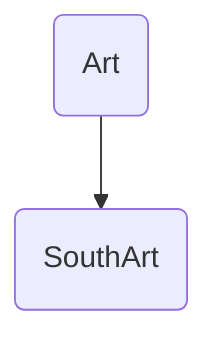
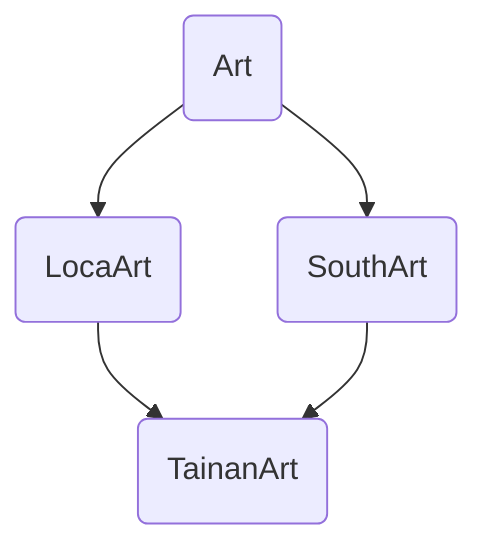

# super() function
## ```super().__init__()``` 與 直接使用母類別的名稱繼承的差異
#### 本文將使用到的Demo Code情境如下
```
class Art():
	def __init__(self):
		print('Art Museum')

class LocalArt(Art):
	def __init__(self):
		print('Local Art Museum')
		super().__init__() 

class SouthArt(Art):
	def __init__(self):
		print('TW South Art Museum')
		super().__init__()#使用super()繼承

class TainanArt(SouthArt,LocalArt): ##multi inheretance
	def __init__(self):
		print('TN Art Museum')
		super().__init__()    #使用super()繼承
		    
		SouthArt().__init__() #直接使用母類別的名稱繼承
		LocalArt().__init__()#直接使用母類別的名稱繼承
```
## 單一繼承(使用於大部分狀況)
### **<font color=#800000>```super().__init__()```和母類別繼承的效果相同</font>**
何為單一繼承：
* 類別架構如下的繼承方式便是單一繼承，也是最簡單的繼承架構



```
class Art():
	def __init__(self):
		print('Art Museum')

class SouthArt(Art):
	def __init__(self):
		print('TW South Art Museum')
		super().__init__()     #使用super()繼承
		TaiwanArt().__init__() #parent name inheretance

### super() execution result ###
TW South Art Museum
Art Museum

### parent name execution result ###
TW South Art Museum
Art Museum
```
以上例而言，初始化SouthArt物件後，super()與TaiwanArt()輸出結果相同

## 多重繼承(鑽石型)
```super()```會檢查多個父繼承的母類別狀態，並避免重複

何為鑽石型態的多重繼承

class Art():
	def __init__(self):
		print('Art Museum')

class LocalArt(Art):
	def __init__(self):
		print('Local Art Museum')
		super().__init__() 

class SouthArt(Art):
	def __init__(self):
		print('TW South Art Museum')
		super().__init__()#使用super()繼承

class TainanArt(SouthArt,LocalArt): ##multi inheretance
	def __init__(self):
		print('TN Art Museum')
		super().__init__()    #使用super()繼承
		    
		SouthArt().__init__() #直接使用母類別的名稱繼承
		LocalArt().__init__()#直接使用母類別的名稱繼承
```

執行結果
1. 使用```super()```繼承的執行結果
```
tainan_art = TainanArt()
#### super() execution result ####
TN Art Museum
TW South Art Museum
Local Art Museum
Art Museum
```
2. 使用母類別的執行結果
```
tainan_art = TainanArt()
#### result of assigning the name of parent class ####
TN Art Museum
TW South Art Museum
TW Art Museum
TW North Art Museum
TW Art Museum
```

ref : 
[A simple explanation of super() in Python - YouTube](https://www.youtube.com/watch?v=zS0HyfN7Pm4)
